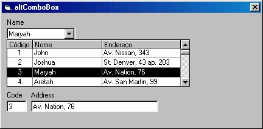



## ComboBox with more than columns

### Description

New version: 0.2a. To leave of this version, besides returning the value selected for altComboBox, also it is possible to return the value from the other columns for any control of the form. The component still is in development phase.
 
### More Info
 

             |
---                |---
**Submitted On**   |2002-08-12 22:46:28
**By**             |[Marcelo Luiz Altafin](https://github.com/Planet-Source-Code/PSCIndex/blob/master/ByAuthor/marcelo-luiz-altafin.md)
**Level**          |Intermediate
**User Rating**    |4.6 (23 globes from 5 users)
**Compatibility**  |VB 6\.0
**Category**       |[OLE/ COM/ DCOM/ Active\-X](https://github.com/Planet-Source-Code/PSCIndex/blob/master/ByCategory/ole-com-dcom-active-x__1-29.md)
**World**          |[Visual Basic](https://github.com/Planet-Source-Code/PSCIndex/blob/master/ByWorld/visual-basic.md)
**Archive File**   |[ComboBox\_w1173438122002\.zip](https://github.com/Planet-Source-Code/marcelo-luiz-altafin-combobox-with-more-than-columns__1-37751/archive/master.zip)

